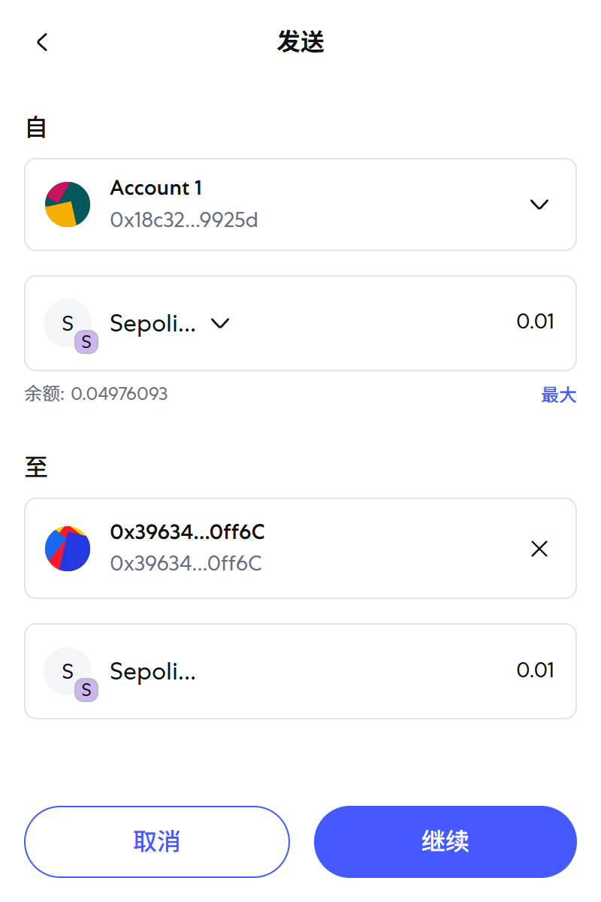
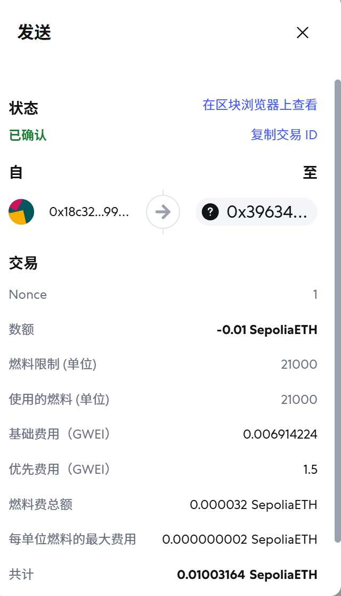
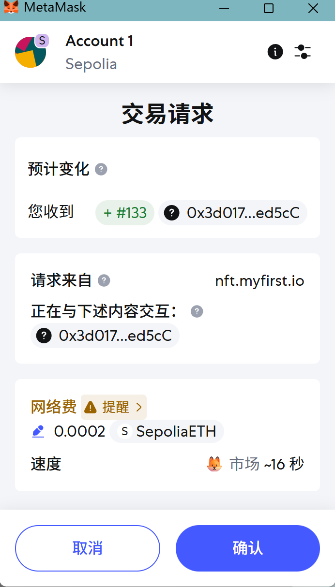

# Web3 学习周记：从链上交互到 ERC-7962 技术深究

本周通过高强度的学习，完成了从 Web3 钱包基础交互、安全防钓鱼演练、以太坊底层原理学习，到 ERC-7962 协议深究的完整闭环。同时，结合个人数据分析的背景，对 Web3 招聘赛道进行了竞品分析，并搭建了[个人博客](http://xxxmingyue.github.io)用于沉淀安全相关的学习成果。

---

## 01. Web3 启程：钱包与交互实操

### 环境搭建与首笔交易

参考 [Wallet Setup Guide](https://unphishable.io/challenges/wallet-setup-guide?lang=en) 完成了 MetaMask（小狐狸）钱包的创建与配置。

* **核心动作**：领取 Sepolia 测试网 ETH，体验了向同学转账的全过程，并学会使用 Etherscan 验证链上数据。

*图：转账记录*

*图：Etherscan 上的交易确认*

### 铸造人生第一个 NFT

通过 [My First NFT](https://nft.myfirst.io/) 项目，了解了 NFT 铸造的基本流程。

* **体验**：连接钱包 -> 选择头像 -> 支付 Gas -> 链上确认 -> 在收藏品中查看。这不仅仅是一张图片，更是对 ERC-721 标准的一次直观体验。

---

## 02. 安全实战：Unphishable 挑战赛

安全是 Web3 的基石。通过 Unphishable 的靶场演练，深入理解了常见的钓鱼手法。

### 核心关卡复盘

1. **Wallet Recovery Assistant**：
* **陷阱**：诱导用户在对话中提供助记词。
* **对策**：**永远拒绝泄漏助记词给任何人或网页**。这是资产安全的底线。

2. **USDC Permit Phishing**：
* **原理**：利用 `Permit` 离线签名机制，诱导用户签署无限额代币授权。
* **操作**：在弹出的签名请求中，仔细核对授权内容，果断拒绝不明来源的请求。

3. **其他常见骗局**：
* **Airdrop 诈骗**：很多所谓的“空投领取”实际上是诱导你发起一笔将 ETH 发送给攻击者的交易。
* **Approve 钓鱼**：警惕对恶意合约的无限额 USDT 提取授权。

---

## 03. 理论深潜：重读《学习以太坊》

### DAO：去中心化的治理

* **定义**：基于区块链智能合约自动执行规则的组织。
* **L1 vs L2**：
* **L1 (主干道)**：如以太坊主网，负责核心共识与安全。
* **L2 (高速辅路)**：如 Rollups，处理计算并打包数据回 L1，解决拥堵与高费率问题。

### 以太坊核心概念解析

#### 1. 智能合约与代币标准

* **ERC-20**：同质化代币（如 USDT），每一枚都一样，可互换。
* **ERC-721**：非同质化代币（NFT），独一无二，如数字艺术品。
* **ERC-1155**：多代币标准，支持在一个合约中同时包含同质化和非同质化代币，且支持批量转账，大幅节省 Gas。

#### 2. Gas 费机制

以太坊的“油费”计算公式：

* **Gas Limit**：事情有多复杂？（转账简单，DeFi 交互复杂）。
* **Base Fee**：网络拥堵程度决定的“最低指导价”，直接销毁。
* **Priority Fee**：给矿工/验证者的“加急小费”。

#### 3. Dencun 升级与 Blob

* **核心**：EIP-4844 (Proto-Danksharding)。
* **比喻**：给卡车（以太坊区块）挂了一个廉价的临时货箱（Blob）。L2 的数据不再占用昂贵的车内座位（Call Data），而是放在廉价货箱里，大幅降低了 L2 的交互成本。

#### 4. 升级代理模式 (Proxy Patterns)

为了解决区块链“不可篡改”带来的代码无法更新问题，采用了“灵肉分离”的策略：

* **逻辑合约**：存放代码逻辑（灵魂）。
* **代理合约**：存放数据状态（肉体），并指向逻辑合约。
* **升级**：只需修改代理合约的指向，即可使用新的逻辑，同时保留原有数据。

---

## 04. 行业观察：Web3 招聘赛道竞品分析

本周结合产品思维，对目前的 Web3 招聘平台做了一次简要调研。

| 平台 | 模式特点 | 流量入口 | 盈利模式 | Web2 vs Web3 |
| --- | --- | --- | --- | --- |
| **Web3.career** | 流量分发型，追求大而全，SEO 极强 | Google 搜索 SEO | 企业付费发帖、竞价排名 | 偏 Web2.5，传统流量生意 |
| **Dejob** | 社群+猎头服务，私域流量 | Telegram、合作伙伴互推 | 广告投放、猎头佣金 | 运营重 Web3 (TG)，产品偏 Web2 |
| **Cryptojoblist** | 垂直老牌，注重雇主品牌建设 | 品牌积累、Newsletter | 阶梯式付费发帖 | Web2 模式 |
| **AbetterWeb3** | 信息聚合，社区共建 (Notion) | Twitter、社群口碑 | 非盈利/捐赠 | 精神内核最 Web3 (开源/透明) |

**思考**：目前的招聘平台大多仍在用 Web2 的逻辑做 Web3 的生意。未来的机会可能在于结合**链上数据分析**，验证求职者的真实技能（如 Github 贡献、链上交互记录），或利用 DID 建立更可信的人才库。

---

## 05. 技术前沿：ERC-7962 协议初探

ERC-7962 提出了一种将代币所有权绑定到**公钥哈希 (KeyHash)** 而非地址的机制，这为隐私和账户抽象提供了新的思路。

### 核心逻辑

1. **所有权绑定**：链上存储 `KeyHash = keccak256(key)`，不直接暴露地址。
2. **签名验证 (Signature Verification)**：
* 交易时传入明文公钥 `key`。
* 合约验证 `keccak256(key)` 是否匹配所有者。
* 利用 `ecrecover` 恢复签名者地址，并验证该地址是否由传入的 `key` 派生。

3. **隐私设计**：
* **找零机制**：类似比特币 UTXO，强制要求找零地址 (`leftKeyHash`) 不等于原地址，推动密钥轮换。
* **Gas 分离**：支持 Relayer 代付 Gas，实现所有权与支付分离。

---

## 06. 学习资源与个人成长

### 安全学习路径

* **团队/资讯**：[SlowMist Team](https://github.com/slowmist) (慢雾)
* **必读**：慢雾《Web3安全手册》
* **课程**：Smart Contract Hacking & Auditing Course, Cyfrin Updraft
* **靶场**：[Damn Vulnerable DeFi](https://www.damnvulnerabledefi.xyz/)

### 个人成长思考

* **目标导向**：设置超出能力 120% 的目标（如 Dune 技术博客、链上攻击追踪）。
* **模仿与超越**：拆解优秀 KOL 的内容结构，从碎片化信息中提炼体系化知识。
* **合规红线**：不服务国内项目，不触碰资金属性红线，严格核对交易对手。

### 下周计划

1. 完成一次区块链攻击的原理复现和链上追踪分享。
2. 撰写一篇 Dune Analytics 的技术分析博客。
3. 参与 LXDAO 社区，探索“公共物品可持续性”的激励机制。

> **我的博客**：[xxxmingyue的个人博客](http://xxxmingyue.github.io)
